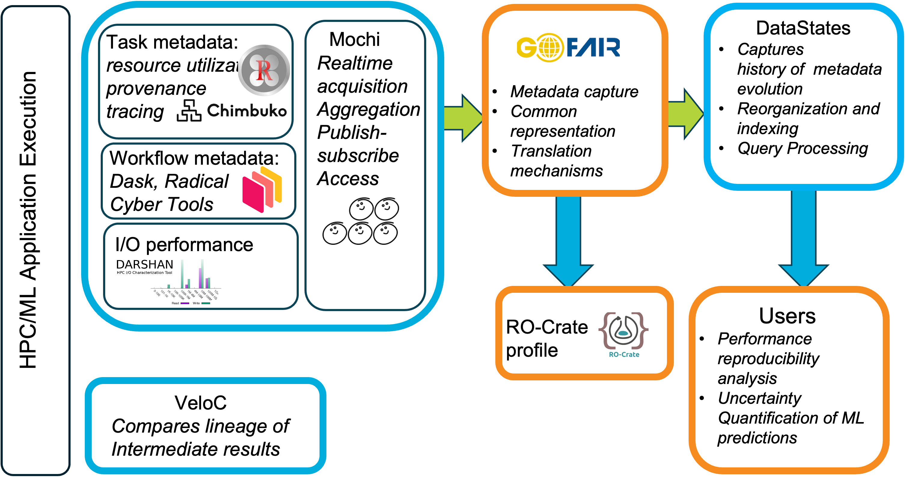

# RECUP: Scalable Metadata and Provenance for Reproducible Hybrid Workflows
We develop methods to enable the reproducibility of performance and scientific results for numerical and data-intensive simulations orchestrated by workflows that run on high performance systems.
The RECUP web site is available here [https://sites.google.com/view/recup-reproducibility/home]
<!--

**Here are some ideas to get you started:**

🙋‍♀️ A short introduction - what is your organization all about?
🌈 Contribution guidelines - how can the community get involved?
👩‍💻 Useful resources - where can the community find your docs? Is there anything else the community should know?
🍿 Fun facts - what does your team eat for breakfast?
🧙 Remember, you can do mighty things with the power of [Markdown](https://docs.github.com/github/writing-on-github/getting-started-with-writing-and-formatting-on-github/basic-writing-and-formatting-syntax)
-->
  
